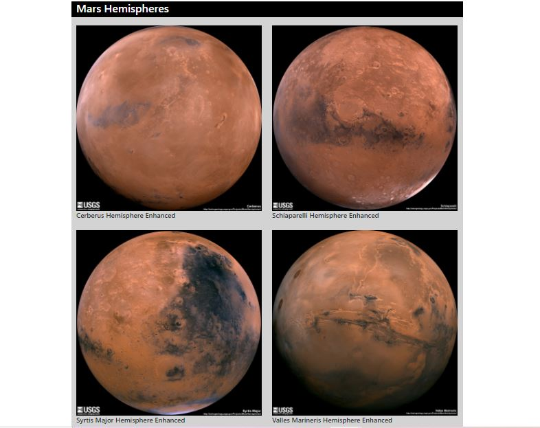

# Web-Scraping-Challenge -  Web Scraping - Mission to Mars  
 **Submitted By:** Saloni Gupta\
_Date_: december, 23rd, 2020 
 
Web Scraping - Mission to Mars   
### Background
Mars is the fourth planet from the Sun and the second-smallest planet in the Solar System, being only larger than Mercury. In English, Mars carries the name of the Roman god of war and is often referred to as the "Red Planet".

In this Project, I build a web application that scrapes various websites for data related to the Mission to Mars and displayed the information in a single HTML page.

 

### Step 1 - Scraping
The initial scraping is conducted by using Jupyter Notebook, BeautifulSoup, Pandas, and Requests/Splinter, and a Jupyter Notebook file called [mission_to_mars](./Mission_to_Mars/mission_to_mars.ipynb) is used to complete all the scraping and analysis tasks.

#### NASA Mars News
I scraped the NASA Mars News Site and collected the latest News Title and Paragraph Text. The result looks as follows:

Title:  NASA's MAVEN Observes Martian Night Sky Pulsing in Ultraviolet Light
Paragraph:  Vast areas of the Martian night sky pulse in ultraviolet light, according to images from NASA’s MAVEN spacecraft. The results are being used to illuminate complex circulation patterns in the Martian atmosphere.

#### JPL Mars Space Images - Featured Image
- Visited the url for JPL Featured Space Image here, and used splinter to navigate the site and find the image url for the current Featured Mars Image and assign the url string to a variable called featured_image_url.

- The image url is setuped to the full size .jpg image, and saved a complete url string for this image. The output looks as follows:

https://www.jpl.nasa.gov/spaceimages/images/largesize/PIA19330_hires.jpg

### Mars Facts
- Visited the Mars Facts webpage here and used Pandas to scrape the table containing facts about the planet including Diameter, Mass, etc and converted the data to a HTML table string.
The output looks as follows:
HTML

<table border="1" class="dataframe">
  <thead>
    <tr style="text-align: center;">
      <th>Description</th>
      <th>Mars</th>
    </tr>
  </thead>
  <tbody>
    <tr>
      <td>Equatorial Diameter</td>
      <td>6,792 km</td>
    </tr>
    <tr>
      <td>Polar Diameter</td>
      <td>6,752 km</td>
    </tr>
    <tr>
      <td>Mass</td>
      <td>6.39 × 10^23 kg (0.11 Earths)</td>
    </tr>
    <tr>
      <td>Moons</td>
      <td>2 (Phobos &amp; Deimos)</td>
    </tr>
    <tr>
      <td>Orbit Distance</td>
      <td>227,943,824 km (1.38 AU)</td>
    </tr>
    <tr>
      <td>Orbit Period</td>
      <td>687 days (1.9 years)</td>
    </tr>
    <tr>
      <td>Surface Temperature</td>
      <td>-87 to -5 °C</td>
    </tr>
    <tr>
      <td>First Record</td>
      <td>2nd millennium BC</td>
    </tr>
    <tr>
      <td>Recorded By</td>
      <td>Egyptian astronomers</td>
    </tr>
  </tbody>
</table>
#### Mars Hemispheres
- Visited the USGS Astrogeology site here, and obtained high resolution images for each of Mar's hemispheres.

- Clicked each of the links to the hemispheres in order to find the image url to the full resolution image. Then, saved both the image url string for the full resolution hemisphere image, and the Hemisphere title containing the hemisphere name, and stored in the a Python dictionary by using the keys img_url and title.

### Step 2 - MongoDB and Flask Application
Used MongoDB with Flask templating to create a new HTML page that displays all of the information that was scraped from the URLs. Then after, converted the Jupyter notebook into a Python script called scrape_mars.py with a function called scrape that will execute all of the scraping code from above and return one Python dictionary containing all of the scraped data.

- Next, I created a route called /scrape that will import scrape_mars.py script and call scrape function.
I stored the returned values in Mongo as a Python dictionary.

- Created a root route / that will query the Mongo database and pass the mars data into an HTML template to display the data.

Finally, created a template HTML file called index.html that take the mars data dictionary, and displayed all of the data in the appropriate HTML elements. The final display looks as followed:

